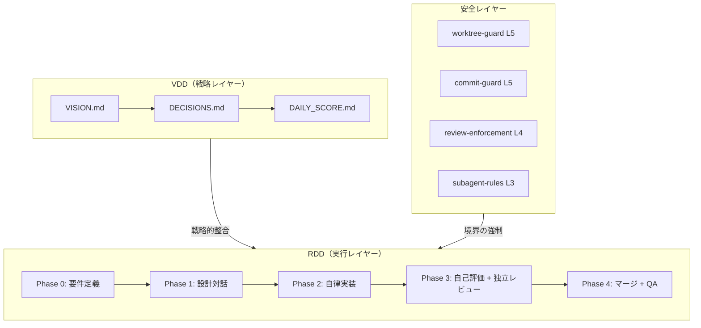

# VDD Framework

**Vision-Driven Development** — AI 自律開発のための、安全境界が技術的に強制されたフレームワーク。

> 「ルールを文書化するのではなく、技術的に強制する。」

[English version](README.md)

## VDD とは

VDD Framework は、AI 自律開発のための完全な方法論とツーリングを提供します。2つの中核的アイデアに基づいています：

1. **Vision-Driven Development (VDD)**: 構造化された意思決定、日次スコアリング、ディベートによるバリデーションを通じて、プロジェクトをビジョンに沿って保つ
2. **Release-Driven Development (RDD)**: AI が実装・テスト・レビューを自律的に行いながら、小さく安全でロールバック可能なリリースを出荷する

フレームワークは **git worktree 隔離**、**フックベースのガードレール**、人間と AI の**明確な権限マトリクス**によって安全性を強制します。

```
人間が WHAT と WHY を決定 → AI が HOW を決定し実行
   (ビジョン + QA)            (実装 + レビュー)
```

## 設計思想: 境界が自律性を生む

高い自律性と確立された境界は、コインの裏表である。

AI の安全性に対する従来のアプローチはホワイトリスト方式 — AI が「やっていいこと」を逐一指定するものだ。このフレームワークは逆のアプローチを取る: **「やってはいけないこと」を明示し、それ以外は全て許可する。** main への force-push、ワークツリー外でのファイル編集、レビューなしのマージ — 絶対に起こしてはならない操作の小さな集合を定義することで、AI はその境界内で最大限の自由を得る。

これが機能するのは、境界が**文書化されるだけでなく、技術的に強制される**からだ。フックが危険な操作を物理的にブロックすると分かっていれば、AI エージェントは一つ一つの行動を迷う必要がない — ガードレールが本当のミスを確実に止めてくれると知った上で、自信を持って判断を下せる。ブランチ戦略がこれを補強する: 隔離されたワークツリー内の `release/*` ブランチは AI に完全な自律性を持つサンドボックスを与え、`main` と `develop` は構造的なルールで保護される。

結果として: **境界が明確であるほど、エージェントはより自律的になる。** 制約にもかかわらず、ではなく、制約があるからこそ。

## アーキテクチャ



## クイックスタート

```bash
# 1. フレームワークをクローン
git clone https://github.com/shuhei0866/vdd-framework.git

# 2. プロジェクトに移動
cd your-project

# 3. セットアップウィザードを実行
bash path/to/vdd-framework/scripts/init.sh
```

ウィザードが以下を行います：
- プロジェクトタイプを自動検出（Node.js, Python, Rust, Go）
- 採用レベル（L1-L5）を選択
- 適切なファイルをコピー・設定
- git フックと Claude Code の統合をセットアップ

## 採用レベル

小さく始めて、段階的に成長する。各レベルは前のレベルの上に構築されます。

| レベル | 名前 | 内容 | 価値提案 |
|--------|------|------|---------|
| **L1** | Safe Development | worktree-guard + commit-guard + git-worktrees skill | AI が未コミット作業を壊さない |
| **L2** | Structured Releases | L1 + RDD ワークフロー + リリース仕様書 + 対話ログ保存 | 構造化されたリリースプロセス |
| **L3** | Quality-Enforced | L2 + エージェント + TDD + スキル + レビュー強制 | AI が自律的に実装・テスト・レビュー |
| **L4** | Vision-Aligned | L3 + VDD アーティファクト + 意思決定権限マトリクス | ビジョンに基づく戦略的開発 |
| **L5** | Full Autonomous | L4 + クラウド実行 + ディベートパートナー + マルチ AI レビュー | 完全自律パイプライン |

> **推奨**: まず **L1** で安全モデルを体験し、AI 自律開発の準備ができたら **L3** に進んでください。

## 強制レベル

ルールは文書化されるだけでなく、4つのレベルで技術的に強制されます：

| レベル | ラベル | メカニズム | 回避可能？ |
|--------|--------|-----------|-----------|
| **L5** | フック強制 (deny) | フックがアクションをブロック | 不可 |
| **L4** | フック警告 (ask/block) | フックが確認を要求 | ユーザー承認で可 |
| **L3** | コンテキスト注入 | エージェントコンテキストに自動注入 | エージェントは見えるがハードブロックなし |
| **L2** | プロンプト内ルール | CLAUDE.md に記載のみ | 可（強制なし） |

## ブランチ戦略

3層の簡略化 GitFlow：

```
main (production)     ← 人間が昇格トリガー（リリースフィードバック会）
  ↑
develop (integration) ← 独立レビュー approve 後に AI がマージ
  ↑
release/* (作業)      ← AI が隔離された git worktree で実装
```

## 主要機能

### 安全と隔離
- **Git worktree 隔離** — コード変更は常にワークツリーで行い、メインワーキングツリーには触れない
- **コミットガード** — main への force-push、--no-verify、その他の危険な操作をブロック
- **PR ガード** — クラウド環境での不正な PR 操作を防止

### 自律開発
- **TDD ファースト** — テストを実装の前に書く。コンテキスト注入で強制
- **セルフレビューパイプライン** — AI が品質チェック、自己評価、独立コードレビューを実行
- **マルチ AI レビュー** — 異なる AI の視点で包括的レビュー（例: Claude + Codex）
- **サブエージェントオーケストレーション** — タスク分解による並列実装

### ビジョン整合
- **VISION.md** — プロジェクトの方向性と価値を定義する生きたドキュメント
- **DECISIONS.md** — 文脈と根拠を含む意思決定台帳
- **DAILY_SCORE.md** — 開発の満足度を追跡する日次主観スコア
- **ディベートパートナー** — 外部 AI が実装前にビジョン整合を検証

### 専門エージェント
- **code-reviewer** — 蓄積されたプロジェクト知識による独立コードレビュー
- **implementer** — TDD 駆動の実装専門家
- **release-manager** — リリース作成とバージョニング

### 10 個の組み込みスキル
| スキル | 用途 |
|--------|------|
| `git-worktrees` | 隔離されたワークツリーの作成・管理 |
| `tdd` | サブエージェントによる並列 TDD 実行 |
| `review-now` | ローカル変更の独立コードレビュー |
| `review-pr` | PR コードレビュー + GitHub コメント投稿 |
| `release-ready` | リリース前の自己評価チェックリスト |
| `release` | コミット履歴からの GitHub リリース作成 |
| `task-decompose` | 大規模タスクの並列サブタスク分解 |
| `dig` | 構造化された要件明確化 |
| `security-balance` | 4 軸セキュリティトレードオフ評価 |
| `env-secrets` | 環境変数・シークレットの安全な取り扱い |

## ドキュメント

日本語と英語の詳細ドキュメント：

- **日本語**: [docs/ja/](docs/ja/)
  - [フィロソフィ](docs/ja/philosophy.md) — 核心的な信念と設計原則
  - [VDD 仕様](docs/ja/VDD.md) — ビジョン駆動開発
  - [RDD 仕様](docs/ja/RDD.md) — リリース駆動開発
  - [はじめに](docs/ja/getting-started.md) — ステップバイステップガイド
  - [採用レベル](docs/ja/adoption-levels.md) — 段階的採用パス
  - [強制レベル](docs/ja/enforcement-levels.md) — L5〜L2 の階層
  - [意思決定権限マトリクス](docs/ja/decision-authority-matrix.md)
  - [QA レイヤー](docs/ja/qa-layers.md) — 3 層 QA モデル
  - [ブランチ戦略](docs/ja/branch-strategy.md) — 3 層ブランチ構造
  - [クラウド実行](docs/ja/cloud-execution.md) — VPS でのヘッドレス実行
  - [ディベートパートナー](docs/ja/debate-partner.md) — 外部 AI ディベート

- **English**: [docs/en/](docs/en/)
  - [Philosophy](docs/en/philosophy.md)
  - [VDD Specification](docs/en/VDD.md)
  - [RDD Specification](docs/en/RDD.md)
  - [Getting Started](docs/en/getting-started.md)
  - [More...](docs/en/)

## 参照実装

[examples/](examples/) に参照実装があります：

- **[minimal](examples/minimal/)** — Level 1 の最小セットアップ（安全ガードレールのみ）

フル機能の構成は [template/](template/) を参照してください。L1-L5 の全フック、エージェント、スキル、VDD アーティファクトが含まれています。

## 前提条件

- **git** 2.20+（worktree サポート）
- **Claude Code** CLI
- **jq**（フックスクリプト用）
- **gh** CLI（GitHub 連携、L2+）

## コントリビューション

[CONTRIBUTING.md](CONTRIBUTING.md) を参照してください。

## ライセンス

[MIT](LICENSE)

---

**「強制された境界内での最大自律性」** という信念のもとに構築されました。
