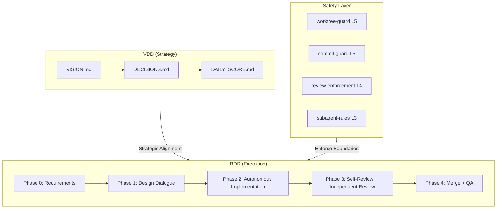

# VDD Framework

**Vision-Driven Development** — A framework for AI-autonomous software development with enforced safety boundaries.

> "Don't just document rules — enforce them technically."

[日本語版はこちら](README.ja.md)

## What is VDD?

VDD Framework provides a complete methodology and tooling for AI-autonomous development, built around two core ideas:

1. **Vision-Driven Development (VDD)**: Keep your project aligned with its vision through structured decision-making, daily scoring, and debate-driven validation
2. **Release-Driven Development (RDD)**: Ship value in small, safe, rollback-friendly releases where AI handles implementation, testing, and review autonomously

The framework enforces safety through **git worktree isolation**, **hook-based guardrails**, and a **clear authority matrix** between humans and AI.

```
Human decides WHAT and WHY → AI decides HOW and executes
     (Vision + QA)              (Implementation + Review)
```

## Architecture



## Quick Start

```bash
# 1. Clone the framework
git clone https://github.com/your-org/vdd-framework.git

# 2. Navigate to your project
cd your-project

# 3. Run the setup wizard
bash path/to/vdd-framework/scripts/init.sh
```

The wizard will:
- Detect your project type (Node.js, Python, Rust, Go)
- Ask you to choose an adoption level (L1-L5)
- Copy and configure the appropriate files
- Set up git hooks and Claude Code integration

## Adoption Levels

Start small, grow incrementally. Each level builds on the previous one.

| Level | Name | What You Get | Value |
|-------|------|-------------|-------|
| **L1** | Safe Development | worktree-guard + commit-guard + git-worktrees skill | AI won't destroy uncommitted work |
| **L2** | Structured Releases | L1 + RDD workflow + release specs + conversation logger | Structured release process |
| **L3** | Quality-Enforced | L2 + agents + TDD + skills + review enforcement | AI autonomously implements, tests, and reviews |
| **L4** | Vision-Aligned | L3 + VDD artifacts + decision authority matrix | Vision-driven strategic development |
| **L5** | Full Autonomous | L4 + cloud execution + debate partner + multi-AI review | Fully autonomous pipeline |

> **Recommendation**: Start with **L1** to experience the safety model, then progress to **L3** when ready for autonomous AI development.

## Enforcement Levels

Rules aren't just documented — they're technically enforced at four levels:

| Level | Label | Mechanism | Bypassable? |
|-------|-------|-----------|-------------|
| **L5** | Hook Enforced (deny) | Hook blocks the action | No |
| **L4** | Hook Warning (ask/block) | Hook requires confirmation | With user approval |
| **L3** | Context Injection | Auto-injected into agent context | Agent sees it, but no hard block |
| **L2** | Prompt-only Rule | Written in CLAUDE.md only | Yes (no enforcement) |

## Branch Strategy

A simplified GitFlow with three layers:

```
main (production)     ← Human promotes (release feedback meeting)
  ↑
develop (integration) ← AI merges after independent review approval
  ↑
release/* (work)      ← AI implements in isolated git worktrees
```

## Features

### Safety & Isolation
- **Git worktree isolation** — All code changes happen in worktrees, never in the main working tree
- **Commit guards** — Blocks force-push to main, --no-verify, and other dangerous operations
- **PR guards** — Prevents unauthorized PR operations in cloud environments

### Autonomous Development
- **TDD-first** — Test before implementation, enforced via context injection
- **Self-review pipeline** — AI runs quality checks, self-evaluation, and independent code review
- **Multi-AI review** — Different AI perspectives for comprehensive review (e.g., Claude + Codex)
- **Subagent orchestration** — Parallel implementation with task decomposition

### Vision Alignment
- **VISION.md** — Living document defining project direction and values
- **DECISIONS.md** — Decision ledger with context and rationale
- **DAILY_SCORE.md** — Subjective daily score tracking development satisfaction
- **Debate partner** — External AI validates vision alignment before implementation

### Specialized Agents
- **code-reviewer** — Independent code review with accumulated project knowledge
- **implementer** — TDD-driven implementation specialist
- **release-manager** — Release creation and versioning

### 10 Built-in Skills
| Skill | Purpose |
|-------|---------|
| `git-worktrees` | Create and manage isolated worktrees |
| `tdd` | Parallel TDD execution with subagents |
| `review-now` | Independent code review on local changes |
| `review-pr` | PR code review with GitHub comment posting |
| `release-ready` | Pre-release self-evaluation checklist |
| `release` | GitHub release creation from commit history |
| `task-decompose` | Break large tasks into parallel subtasks |
| `dig` | Structured requirement clarification |
| `security-balance` | 4-axis security trade-off evaluation |
| `env-secrets` | Safe handling of environment variables and secrets |

## Documentation

Detailed documentation is available in both English and Japanese:

- **English**: [docs/en/](docs/en/)
  - [Philosophy](docs/en/philosophy.md) — Core beliefs and design principles
  - [VDD Specification](docs/en/VDD.md) — Vision-Driven Development
  - [RDD Specification](docs/en/RDD.md) — Release-Driven Development
  - [Getting Started](docs/en/getting-started.md) — Step-by-step guide
  - [Adoption Levels](docs/en/adoption-levels.md) — Incremental adoption path
  - [More...](docs/en/)

- **Japanese / 日本語**: [docs/ja/](docs/ja/)
  - [フィロソフィ](docs/ja/philosophy.md) — 核心的な信念と設計原則
  - [VDD 仕様](docs/ja/VDD.md) — ビジョン駆動開発
  - [RDD 仕様](docs/ja/RDD.md) — リリース駆動開発
  - [はじめに](docs/ja/getting-started.md) — ステップバイステップガイド
  - [採用レベル](docs/ja/adoption-levels.md) — 段階的採用パス
  - [その他...](docs/ja/)

## Examples

See reference implementations in [examples/](examples/):

- **[minimal](examples/minimal/)** — Minimal Level 1 setup (just safety guardrails)

For a full-featured example, explore [template/](template/) which contains all hooks, agents, skills, and VDD artifacts for levels L1-L5.

## Requirements

- **git** 2.20+ (for worktree support)
- **Claude Code** CLI
- **jq** (for hook scripts)
- **gh** CLI (for GitHub integration, L2+)

## Contributing

See [CONTRIBUTING.md](CONTRIBUTING.md) for guidelines.

## License

[MIT](LICENSE)

---

Built with the belief that AI should have **maximum autonomy within enforced boundaries**.
