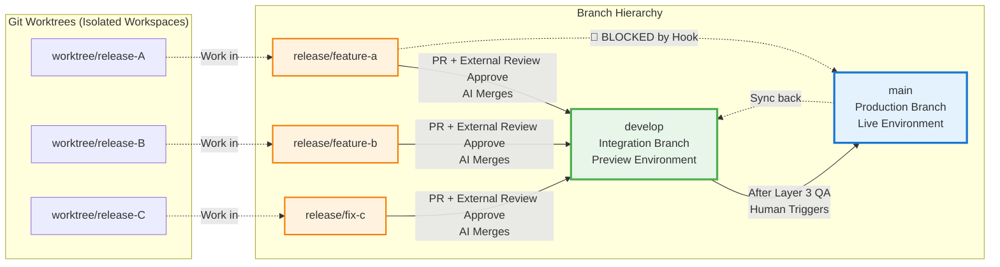

# Branch Strategy Flow

## Overview

This diagram visualizes the three-tier branch structure and merge flow in the VDD Framework.

## Diagram



## Reading Guide

### Three-Tier Structure

```
main (production)     ← Human triggers promotion (Release Feedback Meeting)
  ↑
develop (integration) ← External reviewer approves, AI merges, always-on preview
  ↑
release/* (work)      ← TDD implementation in worktrees
```

### Layer Responsibilities

1. **release/* branches**:
   - Created via `/git-worktrees` skill
   - Isolated in separate worktrees
   - TDD implementation by AI
   - Each release is independent and deployable

2. **develop branch**:
   - Integration branch for all releases
   - Always-on preview environment
   - External reviewer approves, implementation agent merges
   - Never deleted (permanent branch)

3. **main branch**:
   - Production branch
   - Updated only after Layer 3 QA by human
   - Represents live environment state

### Merge Flow

#### Normal Flow (Enforced)

```
release/* → develop → main
```

1. **release/* → develop**:
   - AI creates PR
   - External reviewer reviews and approves
   - Implementation agent polls for approval
   - AI merges after approval confirmed

2. **develop → main**:
   - Human performs Layer 3 QA on preview
   - Human triggers merge at Release Feedback Meeting
   - Represents production promotion

#### Blocked Flow (Hook Enforcement)

```
release/* → main  🚫 BLOCKED
```

Direct merge from `release/*` to `main` is blocked by `commit-guard.sh` hook (L5: deny).

### Hook Enforcement Points

| Action | Hook | Level | Description |
|--------|------|-------|-------------|
| `release/* → main` direct merge | commit-guard.sh | L5: deny | Forces `release/* → develop → main` flow |
| `develop` branch deletion | commit-guard.sh | L5: deny | Protects permanent integration branch |
| File edit in main worktree | worktree-guard.sh | L5: deny | Forces work in isolated worktrees |
| `git checkout` in main worktree | commit-guard.sh | L5: deny | Prevents accidental branch switch |

### Synchronization

After `develop → main` promotion:
```bash
git checkout develop
git rebase main
```

This keeps `develop` synchronized with `main` after production deployment.

### Worktree Isolation

- Each `release/*` branch works in its own worktree
- Main worktree remains read-only for investigation
- Prevents conflicts and accidental data loss
- Multiple releases can be developed in parallel

### Review and Approval

```
[Implementation Agent]
     ↓ Creates PR
[External Review]
     ↓ Approves
[Implementation Agent]
     ↓ Polls for approval
[Implementation Agent]
     ↓ Merges to develop
[Human QA]
     ↓ Layer 3 QA passed
[Human]
     ↓ Merges to main
```

This separation ensures:
- **approve ≠ merge**: Implementation agent merges after approval (job separation)
- **AI autonomy**: No human intervention needed for develop merge
- **Human oversight**: Final production promotion requires human QA
