# Enforcement Level Hierarchy

## Overview

This diagram shows the four-level hierarchy of rule enforcement in the VDD Framework, from technical blocking to prompt-only guidance.

## Diagram

```mermaid
graph TB
    subgraph L5 ["Level 5: Hook Enforcement (deny)"]
        direction LR
        L5D1[worktree-guard.sh<br/>Blocks file edits in main worktree]
        L5D2[commit-guard.sh<br/>Blocks direct release/* → main merge<br/>Blocks develop deletion<br/>Blocks --no-verify<br/>Blocks force push to main]
        L5D3[discord-mention/check.sh<br/>Blocks plain text @mention<br/>Forces &lt;@USER_ID&gt; format]
    end

    subgraph L4 ["Level 4: Hook Warning (ask/block)"]
        direction LR
        L4D1[migration-guard.sh<br/>Warns on duplicate migration numbers]
        L4D2[review-enforcement/check.sh<br/>Blocks session end without review<br/>on release/* branches]
    end

    subgraph L3 ["Level 3: Context Injection"]
        direction LR
        L3D1[subagent-rules/inject.sh<br/>Injects TDD rules to implementer<br/>Injects worktree rules to all agents<br/>Injects review rules to release/* agents]
        L3D2[discord-response-poll/remind.sh<br/>Reminds to poll for external reviewer response<br/>after VDD channel messages]
    end

    subgraph L2 ["Level 2: Prompt-Only Rules"]
        direction LR
        L2D1[rdd-reminder/remind.sh<br/>Reminds RDD workflow<br/>on implementation requests]
        L2D2[CLAUDE.md<br/>All documented rules<br/>without hook enforcement]
    end

    L5 -->|Cannot bypass| L4
    L4 -->|User can override| L3
    L3 -->|Automatic but soft| L2
    L2 -->|Guidance only| Bottom[Agent follows if remembers]

    classDef l5Style fill:#ffcdd2,stroke:#c62828,stroke-width:3px
    classDef l4Style fill:#ffe0b2,stroke:#e65100,stroke-width:3px
    classDef l3Style fill:#fff9c4,stroke:#f57f17,stroke-width:2px
    classDef l2Style fill:#e8f5e9,stroke:#2e7d32,stroke-width:2px

    class L5,L5D1,L5D2,L5D3 l5Style
    class L4,L4D1,L4D2 l4Style
    class L3,L3D1,L3D2 l3Style
    class L2,L2D1,L2D2 l2Style
```



## Reading Guide

### Enforcement Levels

The framework uses a four-level hierarchy to enforce rules with varying degrees of strictness:

#### Level 5: Hook Enforcement (deny) - Absolute Block

**Characteristics**:
- Technical blocking via pre-tool-use hooks
- Cannot be bypassed by AI or human
- Returns `deny` to prevent tool execution

**Examples**:
- `worktree-guard.sh`: Blocks any file Write/Edit in main worktree
- `commit-guard.sh`: Blocks protected git operations (release/* → main, develop deletion, etc.)
- `discord-mention/check.sh`: Blocks plain text @mention in Discord messages

**Use case**: Critical safety rules that must never be violated

#### Level 4: Hook Warning (ask/block) - User Confirmation Required

**Characteristics**:
- Hook detects potential issue
- Prompts user for confirmation
- User can override after seeing warning

**Examples**:
- `migration-guard.sh`: Warns when migration number already exists
- `review-enforcement/check.sh`: Blocks session end if release/* branch lacks review

**Use case**: Important rules where occasional override may be intentional

#### Level 3: Context Injection - Automatic Reminder

**Characteristics**:
- Injects additional context into agent's system prompt
- Agent receives rules automatically without manual reminder
- Soft enforcement - agent should follow but technically can ignore

**Examples**:
- `subagent-rules/inject.sh`: Auto-injects TDD rules, worktree rules, review requirements
- `discord-response-poll/remind.sh`: Reminds to poll for external reviewer response

**Use case**: Rules that should always apply but may need contextual interpretation

#### Level 2: Prompt-Only Rules - Guidance

**Characteristics**:
- Documented in CLAUDE.md only
- No technical enforcement
- Relies on agent memory and instruction following

**Examples**:
- `rdd-reminder/remind.sh`: Reminds of RDD workflow on main branch
- General CLAUDE.md guidelines without hooks

**Use case**: Best practices and preferences that allow flexibility

### Pyramid Structure

```
       L5 (deny)          ← Strictest: Cannot bypass
          ↑
       L4 (ask)           ← Strict: User can override
          ↑
    L3 (inject)           ← Moderate: Automatic reminder
          ↑
    L2 (prompt)           ← Loosest: Guidance only
```

The hierarchy represents decreasing enforcement strength from top to bottom.

### Hook Event Types

| Event | Timing | Common Use Cases |
|-------|--------|------------------|
| PreToolUse | Before tool execution | Block dangerous operations (L5), warn on risks (L4) |
| PostToolUse | After tool execution | Trigger follow-up actions (L3) |
| SubagentStart | Agent initialization | Inject context and rules (L3) |
| UserPromptSubmit | User sends message | Provide reminders (L2) |
| Stop | Session ending | Check completion requirements (L4) |
| SessionEnd | After session cleanup | Log conversations |

### Design Principles

1. **Use L5 sparingly**: Only for rules that absolutely must not be broken
2. **L4 for important but context-dependent rules**: Allow override with awareness
3. **L3 for consistent application**: Reduce need for manual instruction
4. **L2 for flexible guidance**: Document without forcing

### Example: Worktree Rule Enforcement

The "work in worktree" rule is enforced at multiple levels:

- **L5**: `worktree-guard.sh` blocks Write/Edit in main worktree
- **L5**: `commit-guard.sh` blocks checkout/switch in main worktree
- **L3**: `subagent-rules/inject.sh` reminds agents to use worktrees
- **L2**: CLAUDE.md documents the worktree workflow

This layered approach ensures the rule is both technically enforced and well-understood by agents.
