# RDD Phase Flow

## Overview

This diagram details the five phases of Release-Driven Development (RDD), showing who does what at each stage.

## Diagram

```mermaid
sequenceDiagram
    participant H as Human
    participant AI as Claude Code
    participant OC as External Reviewer
    participant Repo as Git Repository

    rect rgb(240, 248, 255)
        Note over H,AI: Phase 0: Requirements Definition
        H->>AI: Define user story & goals
        H->>AI: Specify constraints
        Note right of H: Focus on "what" not "how"
    end

    rect rgb(255, 250, 240)
        Note over H,AI: Phase 1: Design Dialogue
        AI->>H: Propose implementation approach
        H->>AI: Discuss & refine
        AI->>AI: Draft release spec

        alt Debate Partner Enabled
            AI->>OC: Send release spec + questions
            OC->>AI: Challenge vision alignment
            AI->>OC: Defend/refine based on feedback
            OC->>AI: Final critique
        end

        AI->>H: Present release spec + debate summary
        H->>AI: approve / reject / conditional

        alt approved
            AI->>Repo: Commit release spec to .claude/release-specs/
        end
    end

    rect rgb(240, 255, 240)
        Note over AI,Repo: Phase 2: Autonomous Implementation
        AI->>Repo: Create release/* branch via worktree

        loop TDD Cycle
            AI->>AI: Write failing test (Red)
            AI->>AI: Implement to pass (Green)
            AI->>AI: Refactor
            AI->>Repo: Commit
        end

        Note right of AI: AI operates autonomously<br/>within release spec scope
    end

    rect rgb(255, 245, 240)
        Note over AI,Repo: Phase 3: Self-Review
        AI->>AI: Run /release-ready (self-evaluation)
        AI->>AI: Run /review-now (code-reviewer agent)
        AI->>AI: Run /codex-review (external AI)

        alt Issues found
            AI->>AI: Fix issues
            AI->>Repo: Commit fixes
        end

        AI->>Repo: Create PR to develop
        Note right of AI: PR includes review results<br/>+ insights + diagrams
    end

    rect rgb(248, 240, 255)
        Note over H,Repo: Phase 4: Merge + QA
        AI->>OC: Request PR approval via Discord

        loop Wait for approval
            AI->>Repo: Poll PR review status
        end

        OC->>Repo: Approve PR
        AI->>Repo: Merge PR to develop

        Note over H: Layer 1: Automated (AI)<br/>Layer 2: Visual Check (AI + Human)<br/>Layer 3: Exploratory QA (Human)

        H->>H: QA on preview environment

        alt QA passed
            H->>Repo: Merge develop → main
        else QA failed
            H->>AI: Request fixes
        end
    end

    Note over H,Repo: Cycle repeats for next release
```

## Reading Guide

### Role Distribution

| Phase | Primary Actor | Secondary Actor | Key Activities |
|-------|---------------|-----------------|----------------|
| Phase 0 | Human | - | Define requirements, goals, constraints |
| Phase 1 | Human + AI | External Reviewer (optional) | Design dialogue, debate, approve spec |
| Phase 2 | AI | - | TDD implementation, autonomous execution |
| Phase 3 | AI | External reviewers | Multi-perspective review, PR creation |
| Phase 4 | AI + Human | External Reviewer | AI merges after approval, Human does QA |

### Critical Points

1. **Human Decision Gates**:
   - Phase 1 exit: Approve/reject release spec
   - Phase 4 exit: Approve/reject main merge after QA

2. **AI Autonomy Zones**:
   - Phase 2: Fully autonomous within spec scope
   - Phase 3: Independent review with multiple AI perspectives

3. **External AI Integration**:
   - External Reviewer: Debate partner (Phase 1) and PR approver (Phase 4)
   - Codex: Independent code reviewer (Phase 3)

### Debate Partner (Optional)

The debate partner in Phase 1 challenges vision alignment before implementation:
- **Purpose**: Surface hidden assumptions and validate "why"
- **Scope**: Strategic validation, not code review
- **Output**: Critique summary recorded in DECISIONS.md

### QA Layers

Phase 4 includes three quality layers:
1. **Layer 1 (Automated)**: Type check, lint, tests - fully automated
2. **Layer 2 (Visual)**: Screenshot evaluation, preview operation - AI + human
3. **Layer 3 (Exploratory)**: Direct interaction with preview - human only

AI iterates Layer 1 and 2 until passing. Human performs Layer 3 before main merge.
