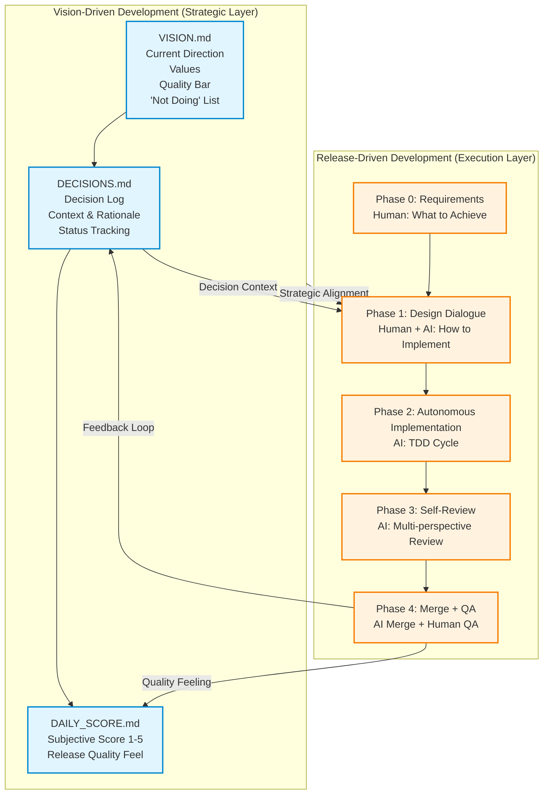

# VDD and RDD Relationship

## Overview

This diagram illustrates the relationship between VDD (Vision-Driven Development) as the strategic layer and RDD (Release-Driven Development) as the execution layer.

## Diagram

## Reading Guide

### Two Layers

- **VDD (Vision-Driven Development)**: Strategic layer that manages "what we aim for"
  - `VISION.md`: Current direction, values, quality bar, and 'not doing' list
  - `DECISIONS.md`: Decision log with context and rationale
  - `DAILY_SCORE.md`: Daily subjective score (1-5) on release quality feeling

- **RDD (Release-Driven Development)**: Execution layer that implements "how to deliver"
  - Phase 0: Requirements definition by human
  - Phase 1: Design dialogue between human and AI
  - Phase 2: Autonomous implementation by AI using TDD
  - Phase 3: Self-review by AI with multiple perspectives
  - Phase 4: Merge by AI and QA by human

### Key Connections

1. **Strategic Alignment**: VDD provides strategic context to RDD Phase 1 (Design Dialogue)
2. **Decision Context**: Decision log influences implementation approach
3. **Feedback Loop**: Merge results feed back into decision log
4. **Quality Feeling**: Daily score captures the feeling of "releasing good things quickly"

### Separation of Concerns

By separating VDD (strategy update) and RDD (implementation execution), the framework achieves both:
- Continuous refinement of strategic direction
- Stable and reliable implementation process
