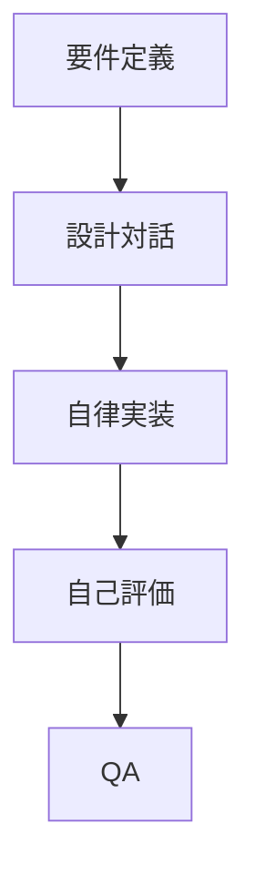

# レビュアー認知特性プロファイル

このファイルは、リリース PR の description を作成する際に AI が参照するレビュアーの認知特性設定です。
AI はこのプロファイルに基づいて、PR description の表現方法を最適化します。

## レビュアー: {{REVIEWER_NAME}}

### 理解しやすい表現

<!-- レビュアーが理解しやすい表現方法を記述してください -->
<!-- 例:
- 図解: Mermaid チャート、フローチャート、状態遷移図
- 構造の可視化: ディレクトリツリー、依存関係グラフ
- コード例: 具体的なコードスニペット
-->

### 図解のトーン

<!-- 図解のスタイルを記述してください -->
<!-- 例:
- 技術ドキュメント調: 簡潔で無駄のない表現
- 色は最小限: 意味のある色分けのみ使用
- 情報密度を高く: 1つの図に必要十分な情報を詰める
-->

### PR description に必ず含めるもの

<!-- PR description に常に含めるべき要素を記述してください -->
<!-- 例:
1. 全体像の図: 変更がシステムのどこに影響するかを示す図
2. データフロー or 状態遷移: 動作の変更がある場合、before/after のフロー図
-->

### 避けるべき表現

<!-- レビュアーにとって理解しにくい表現を記述してください -->
<!-- 例:
- テキストのみの長い説明
- コードの diff だけを貼り付ける
-->

### 図の記法

GitHub PR description では Mermaid がレンダリングされるため、以下のような記法を使う：

